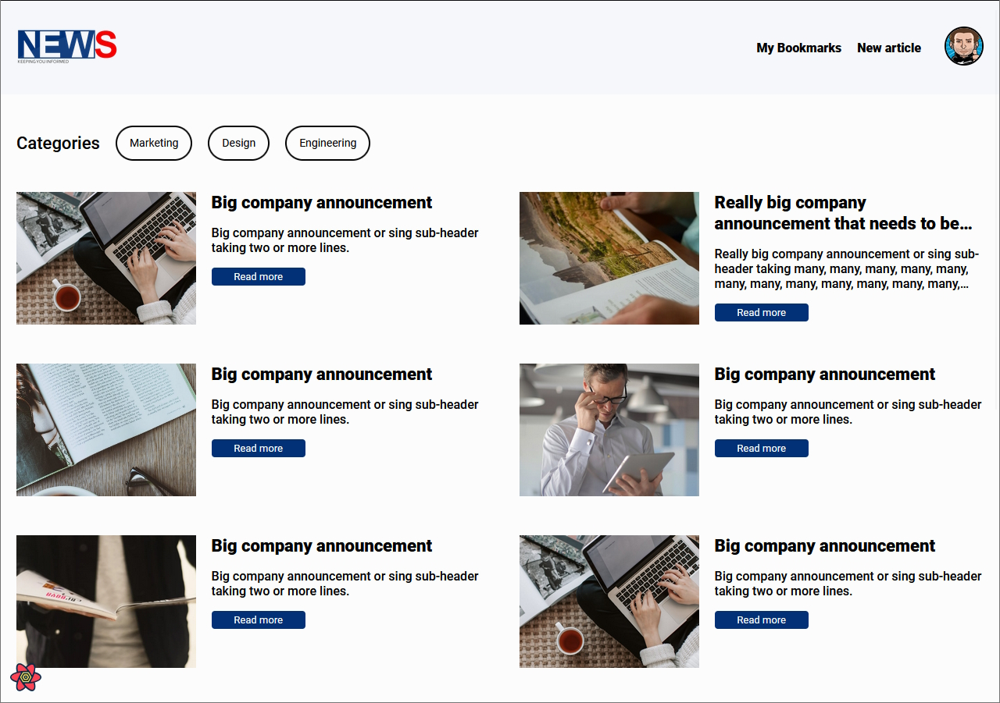
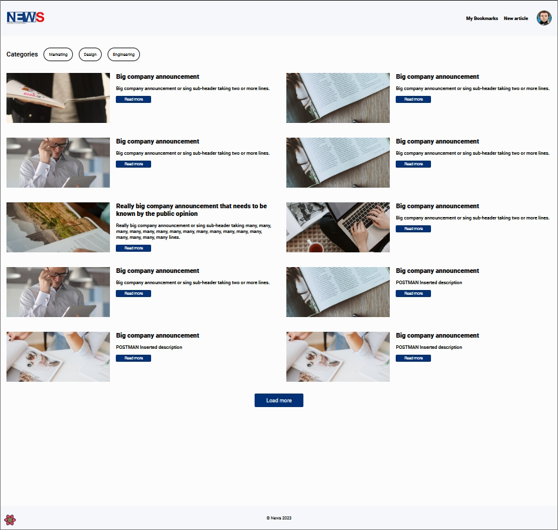
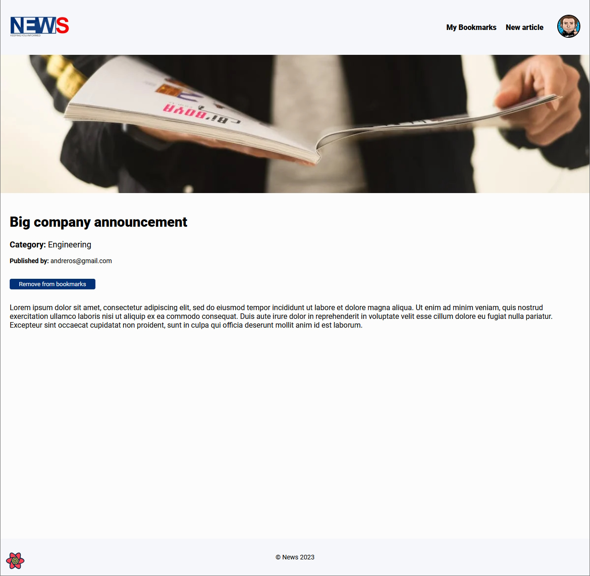
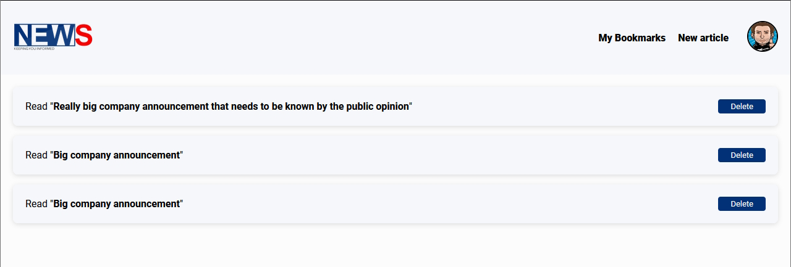
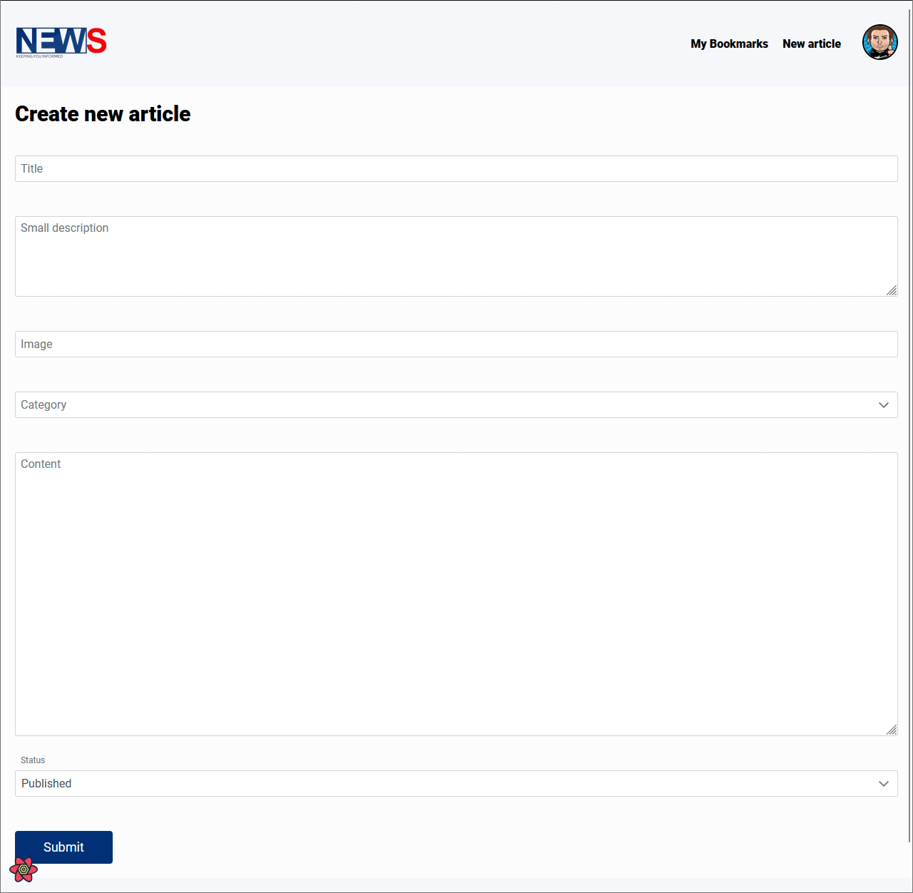
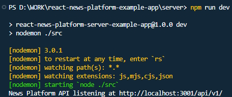

# react-news-platform-example-app

React News Platform - Example Application

This application was made available to showcase some of my technical skills, knowledge gathered as a front-end developer along the way and as a reference for wanted technologies, code examples and problem solutions.

Primarily implemented as a response to a code challenge, this small platform serves a different purpose now: being an evolving project where I experiment with different technologies, implement and learn them as they arise in React ecosystem or front-end realm.

All the current implementations are functional although some may be incomplete. Why? Sometimes, implementing one case of a given technology in this project is enough as a proof of concept, sometimes implementing another standalone project makes more sense, for the sake of the learning experience.

Please, feel free to take a look at my [GitHub repositories](https://github.com/andreros?tab=repositories) to see what's been cooking over the years ;)

## Screenshots

<br/>
<br/>
<br/>
<br/>
<br/>
<br/>
<br/>

## Platform description

In order to achieve a fully functional News Platform, two different application architecture layers were implemented:

- A browser based client application;
- A RESTful API for the backend;

For the purpose of this example it would be enough to build only the client application and inside it some backend
mocking mechanism. However, for the sake of correctness, designing and implementing an API that performs full CRUD operations
over a relational database is a more fulfilling and rewarding coding experience. With this in mind the `SQLite` database
engine was used. Despite not being the perfect solution for a large scale distributed application, it fits the needs of
this project.

## Client application

### Tech Stack

- `React` framework (with Typescript) for the overall application development;
- `SASS` to build the needed application styles;
- `auth0` 3rd party service and software library to implement authentication;
- `Axios` to communicate with the backend API;
- `React-Query` by `TanStack` to retrieve and manage data inside the application;
- `PrimeReact` components to speed up form building;
- `PrimeFlex` CSS utility library to speed up form layout building;
- `Formik` to validate form data on the client side before submitting to the backend;
- `React-Toastify` to show pop-up notifications throughout the application everytime the user needs feedback about a
  performed operation;

### Support tools

- `Webpack` to bundle the application and serve it in development mode;
- `Statoscope` to generate reports about the application;

### Testing tools

- `Jest` javascript testing framework;
- `React Testing Library` testing framework for working with React components;

## Server application

### Tech Stack

- `Express` framework to implement the RESTful API;
- `Better-SQLite3` to interact with a relational `SQLite` database;

### Testing tools

- `Jest` javascript testing framework;
- `supertest` testing framework for working with Express.JS implemented APIs;

## Platform Support tools

- `Prettier` for code formatting;
- `Log4Brains` to manage Architectural Decision Record (ADR) and generate static HTML knowledge base;

## Installation and platform bootstrap

From the project root folder, please execute the following commands in a terminal window:

### Server application

```bash
cd server
npm i & npm run dev
```

or

```bash
cd server
npm i & npm start
```

The API will be accepting requests in the [http://localhost:3001/api/v1/](http://localhost:3001/api/v1/) address.

### Client application

```bash
cd client
npm i & npm run dev
```

and then open the [http://localhost:3000/](http://localhost:3000/) url on your browser.

## Where to go from here (read it "further improvements")

- Implement proper `bearer token` header submission on every authenticated API request and validation on the API side.
  This mechanism was not implemented because there is an open issue on getting the `bearer token` in the client application
  on the `auth0` software library side that prevented the correct implementation of this feature;
- A page to list the articles that belong to the authenticated user;
- A page to edit any article that was written by the authenticated user;
- The ability to switch between a `draft` article and a `published` one anywhere in the application for the authenticated
  user;
